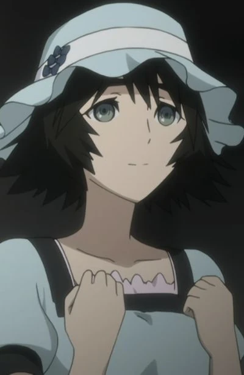

# TLab 2023. Domain-specific content generation - тестовое задание

## Изучение [научной статьи](https://arxiv.org/abs/2208.12242) с описанием метода DreamBooth
### 1. Тема статьи и проблематика
#### a) Что это такое?
Метод, который позволяет дообучить модель преобразования текста в изображение для генерации изображений с определненным объектом, используя лишь несколько изображений с этим объектом.
#### b) Почему над этим работают?
Над данной проблемой работают, потому что решение этой проблемы может иметь несколько применений, таких как:
* Реконтекстуализация - генерация того же объекта, что и в тренировочном сете, но в других контекстах, других позах,с другого угла и т.д.
* Искусство - например, можно генерировать изображения в стиле определенного художника
* Изменение свойств объекта - генерация изображений объекта с измененными свойствами
* Персонализированные аватары - для использования в видеоиграх, социальных сетях или виртуальной реальности
* Маркетинг - Например, компания могла бы использовать его для создания изображений своих продуктов, используемых в различных контекстах, или для создания изображений, привлекательных для определенной целевой аудитории
#### c) Как формулируется задача?
Имея несколько (3-5) изображений определенного объекта без текстового описания, обучить (или дообучить) модель преобразования текста в изображение, способную генерировать новые изображения с этим объектом с высокой точностью детализации и вариациями, используя текстовые запросы
### 2. Обзор статьи и решения
#### a) В чем ее основная идея?
Дообучить диффузионную модель, используя 3-5 изображений объекта в сочетании с текстовым запросом, содержащим уникальный идентификатор и название класса, к которому принадлежит объект (например, “A [V] dog”). Модель оптимизируется с минимизацией reconstruction loss для максимально точной реконструкции изображений с данныим объектом. Параллельно применяется class-specific prior preservation loss, чтобы побудить модель генерировать более разнообразные изображения с классом объекта, используя имя класса в текстовом запросе (например, “A dog”).
#### b) В чем ее новаторство?
Новизна этой статьи заключается в использовании class-specific prior preservation loss, чтобы побудить модель генерировать разнообразные изображения с классом заданного объекта. Этот loss основан на семантическом предварительном знании, которое модель имеет в отношении класса объекта.
#### c) Какие получились результаты?
* Метрики DINO и CLIP показали, что DreamBoth превосходит Textual Inversion как по соответствествию объекта на сгенерированных изображениях, так и по соответствию текстовому запросу, что подтверждается пользовательским опросом
* DreamBoth с использованием Imagen лучше по этим показателям, чем DreamBoth с использованием Stable Diffusion
* Метрики DINO и LPIPS показывают, что prior preservation loss позволяет генерировать более разнообразные изображения с заданными обЪектом и с классом заданного объекта
* Если при обучении задать неверный класс объекта или не задать его вовсе, то результаты ухудшаются с точки зрения соотвествия заданному объекту и текстовому запросу

## Практическая часть
[Ссылка на ggogle colab](https://colab.research.google.com/drive/13IqCGhO70RyaBnzGfwSHN4L2SDAEg_bH?usp=sharing)

### Тренировочные изображения
     

### Результаты
* GUIDANCE = 7.5, LORA_SCALE_TEXT_ENCODER = 0.8, LORA_SCALE_UNET = 0.8
  1) "an image of [ktn] girl eating ice cream"
     
  2) "an image of [ktn] girl on the moon"
     
  3) "an image of [ktn] girl in the acropolis"
     
* GUIDANCE = 15, LORA_SCALE_TEXT_ENCODER = 0.8, LORA_SCALE_UNET = 0.8
  1) "an image of [ktn] girl eating ice cream"
     
  2) "an image of [ktn] girl on the moon"
     
  3) "an image of [ktn] girl in the acropolis"
     

### Выводы
* Несмотря на проблемы с качеством изображений, девушка на сгенерированных изображениях соответствуют девушке из тренировочного сета
* GUIDANCE_SCALE влияет на разнообразие сгенерированных изображений и на их соответствие текстовому запросу. Чем выше данный параметр, тем сгенерированные изображения более соответствуют текстовому запросу, однако при этом уменьшается разнообразие сгенерированных изображений